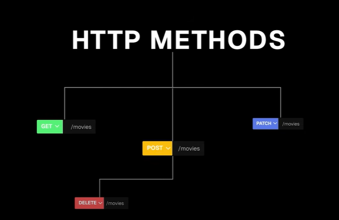
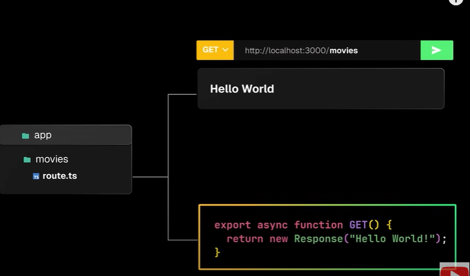

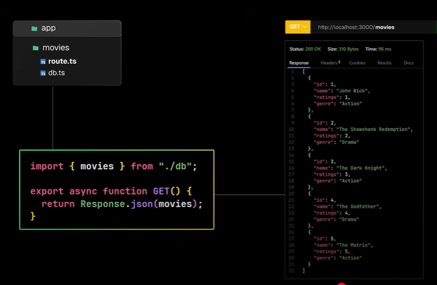

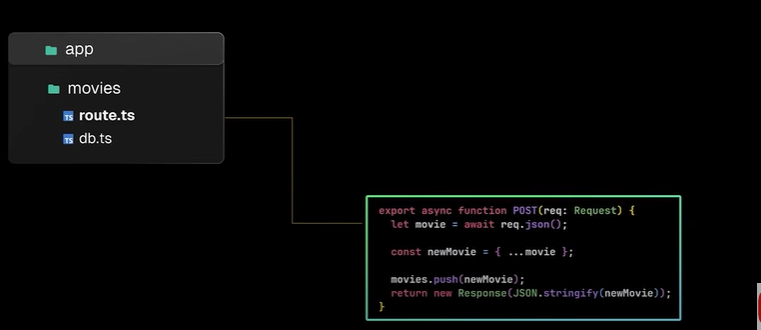
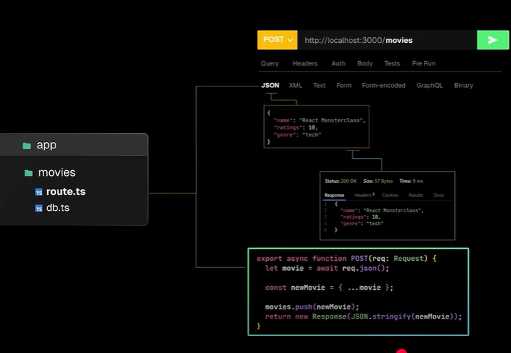
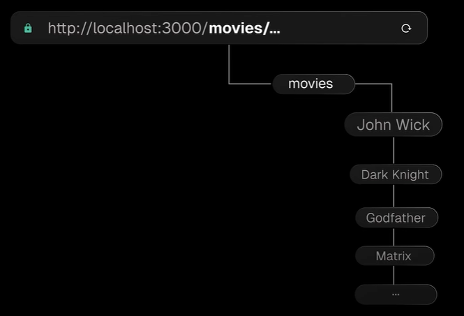

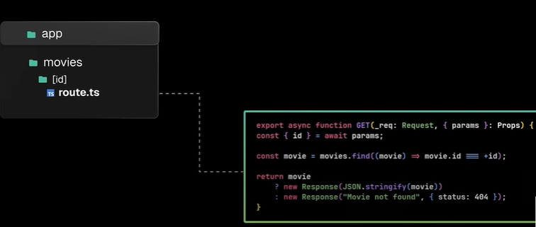
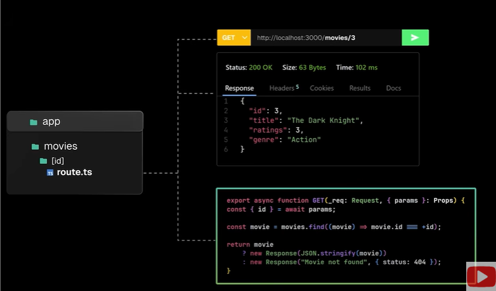


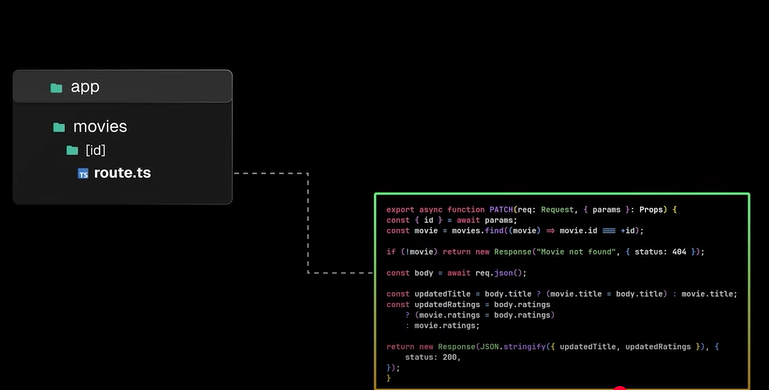

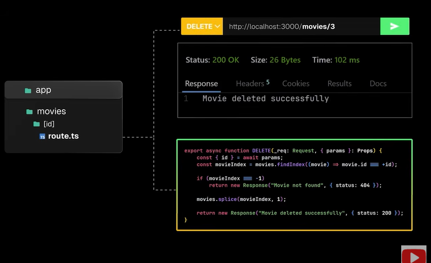

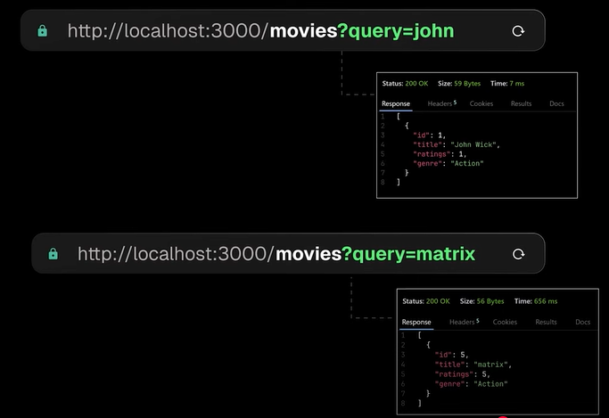

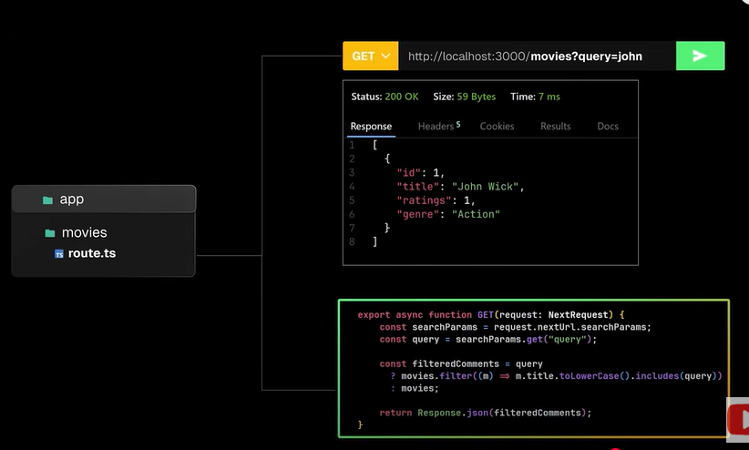


# 🟦 Request (normal one):
- This is like the default request object that comes from the browser or from fetch().
- It gives you access to things like headers, body, and URL.
- It’s plain and simple.
- You use it in most normal API routes.

🧠 Think of it like a basic envelope with a message inside.

```
export async function POST(req: Request) {
  const data = await req.json(); // Read the body
  // Use headers, method, url, etc.
}

``` 

# 🟪 NextRequest (from Next.js):
- This is a special version of Request made by Next.js.
- It gives you some extra tools
- Easily read cookies
- Get the full URL with helpers
- Get location info (geo)
- Use in middleware or special Next.js logic

🧠 Think of it like a smart envelope that not only has a message but also has tracking info, auto-sorting, and extra features.

```
import { NextRequest } from 'next/server';

export function middleware(req: NextRequest) {
  const token = req.cookies.get("token")?.value;
  const country = req.geo?.country;
}

```

# 💡 When to use which?
Where you're working	Use this
API routes or App Router	Request
Middleware in Next.js	NextRequest


# MIDDLEWARE
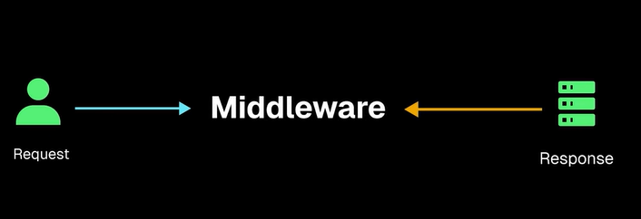
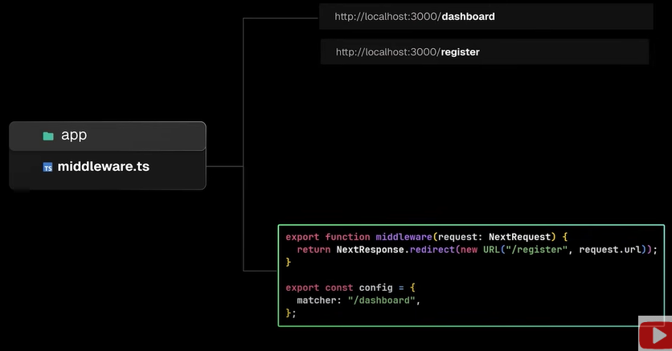


# FONT
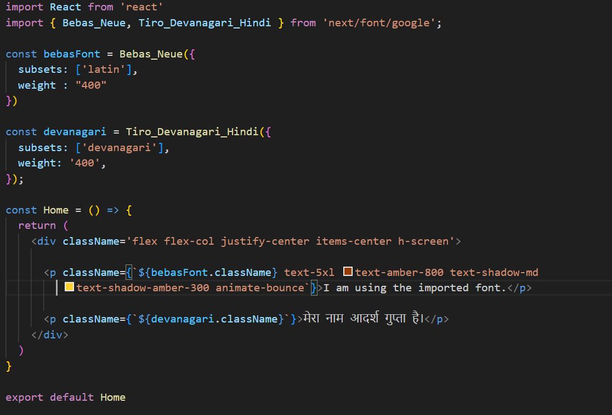

# METADATA

- Static page


- Dynamic page

